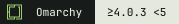

# Version support

Keep the identity badge and compatibility badge separate. For example:

 

The first badge identifies the project. The second states the maintainer's
supported Omarchy range. Neither is a certification or test result.

## Choose a range

| Badge | Meaning |
| --- | --- |
|  | Stable Omarchy releases from 4.0.0 up to, but excluding, 5.0.0. |
|  | Stable Omarchy releases from 4.0.3 up to, but excluding, 5.0.0. |

These are reusable labels, not claims that a particular project supports those
versions. Pick only the range you intend to maintain. Prereleases and development
branches are excluded unless your compatibility notes explicitly include them.
Avoid a bare “4.0.3+” if you do not intend to include future major versions.

The badge describes your declared support policy; it does not prove every
release in that range has been tested. If you have tested only one version and
cannot claim a broader range, document that exact result rather than choosing
a broad support badge.

## Omarchy 4.0.0 and later

The `4.0.0+` preset means stable Omarchy 4.0.0 and later, with no upper major-version bound. Use it only for an open-ended support policy. It is not evidence that future versions have been tested. Prereleases remain excluded unless explicitly documented.

[](#compatibility)

```markdown
[](#compatibility)
```

## Copy into your README

Place the compatibility badge beside your existing Plugin, App, Theme or
general identity badge. These snippets pin the artwork to a commit and link to
a `Compatibility` section in your own README.

**Supports 4.x**

```markdown
[](#compatibility)
```

**Supports at least 4.0.3, below 5**

```markdown
[](#compatibility)
```

**Complete pair**

```markdown
[](https://github.com/tcballard/omarchy-badges)
[](#compatibility)
```

Add the destination section, replacing placeholders with your actual policy and
evidence before publishing:

```markdown
## Compatibility

- Supported Omarchy versions: <your declared range, matching the badge>.
- Last tested: <exact Omarchy version, date and platform>.
- Checks performed: <what you verified, with a link to evidence if available>.
- Known limitations: <relevant exceptions or unverified behaviour>.
```

## Maintaining support

Update your project README's badge URL and compatibility notes when your
support policy changes. Keep historical releases' documentation accurate for
those releases. Reusing the identity badge does not require keeping the same
compatibility badge.

The compatibility SVGs are static: they do not detect your OS version, inspect
a manifest or infer support from CI. Future automation can read an agreed
compatibility field, but this repository does not introduce a manifest schema
or automatic support inference.

If no preset matches your policy, open an issue or PR for the exact label, or
host a custom badge in your own repository. Do not round your range up to fit
an available badge. New presets get separate files; existing pinned artwork
remains unchanged.

Use `omarchy` and the appropriate category topic for discovery. Record exact
version support in compatibility notes rather than creating a topic for every
patch release.
